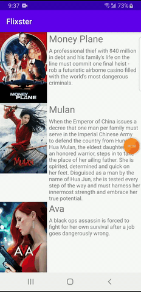

## Flixster - part 2 ##

**Flixster** is an android app that allows users view a list of movies sourced from the The Movie Database API.

Submitted by: **Elena Tarasova**

Time spent: **10** hours spent in total

## User Stories

The following **required** functionality is completed:

* [x] User can view a list of movies (title, poster image, and overview) currently playing in theaters from the Movie Database API.
* [x] The details of movie (ratings using RatingBar, popularity, and synopsis) are exposed in a separate activity. 
* [x] Video posts are allowed to be played in full-screen using the YouTubePlayerView.

## Video Walkthrough

Here's a walkthrough of implemented user stories from version 1:

Here's a screenshot(not a walkthrough since my emulator doesn't work) of implemented user stories from version 2:

GIF created with [LiceCap](http://www.cockos.com/licecap/).

## License

    Copyright [2020] [Elena Tarasova]

    Licensed under the Apache License, Version 2.0 (the "License");
    you may not use this file except in compliance with the License.
    You may obtain a copy of the License at

        http://www.apache.org/licenses/LICENSE-2.0

    Unless required by applicable law or agreed to in writing, software
    distributed under the License is distributed on an "AS IS" BASIS,
    WITHOUT WARRANTIES OR CONDITIONS OF ANY KIND, either express or implied.
    See the License for the specific language governing permissions and
    limitations under the License.
